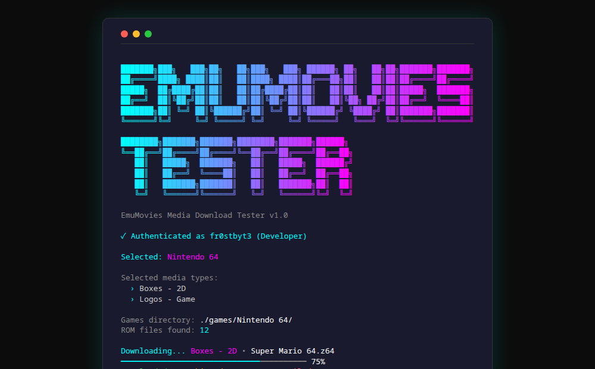

# EmuMovies Tester

A .NET 8 TUI (Text User Interface) app for testing and downloading media from the [EmuMovies](https://emumovies.com) API. Built with [Spectre.Console](https://spectreconsole.net).



## Features

- **OAuth Authentication** — Authenticates against EmuMovies.com, caches credentials and tokens locally
- **System Browser** — Scrollable, filterable list of all gaming systems
- **Media Type Selection** — Multi-select from all available media types (Box Art, Logos, Snaps, Videos, etc.)
- **Smart Game Matching** — Scans your local ROM folder and matches filenames against EmuMovies' library with fuzzy matching
- **Batch Downloads** — Downloads media for all matched games with progress tracking
- **Skip Existing** — Automatically skips files you've already downloaded
- **Summary Report** — Final breakdown of Downloaded, Skipped, Not Available, and Failed counts

## Quick Start

### Prerequisites
- .NET 8.0 SDK (or .NET 9.0+)
- An [EmuMovies.com](https://emumovies.com) account

### Build & Run
```bash
dotnet build
dotnet run
```

### Publish (Windows)
```bash
dotnet publish -c Release -r win-x64 --self-contained
```

## Usage

1. **Launch the app** — The animated logo will display
2. **Login** — Enter your EmuMovies username and password (saved to `.env` for subsequent runs)
3. **Select a system** — Browse or type to filter (e.g., "Nintendo 64")
4. **Select media types** — Use `Space` to toggle, `Enter` to confirm
5. **Place your ROMs** — Put ROM files in `./games/{System Name}/` (e.g., `./games/Nintendo 64/Super Mario 64.z64`)
6. **Download** — The app will match your ROMs against EmuMovies and download media to `./media/{Type}/{System}/`

## Directory Structure

```
emumovies-tester/
├── games/
│   └── Nintendo 64/          # Your ROM files go here
│       ├── Super Mario 64.z64
│       └── GoldenEye 007.z64
├── media/                     # Downloaded media goes here
│   ├── Boxes - 2D/
│   │   └── Nintendo 64/
│   │       ├── Super Mario 64.jpg
│   │       └── GoldenEye 007.jpg
│   └── Logos - Game/
│       └── Nintendo 64/
│           └── ...
├── .env                       # Cached credentials (gitignored)
└── config.json                # Cached auth token (gitignored)
```

## Configuration

Credentials are saved to `.env` on first login:
```
EMUMOVIES_USERNAME=your_email
EMUMOVIES_PASSWORD=your_password
```

Auth tokens are cached in `config.json` and auto-refreshed when expired.

## API

This app connects to:
- **Auth:** `https://emumovies.com/oauth/token/` (OAuth2 password grant)
- **API:** `https://emapi.emumovies.com/api/` (systems, media types, file listing, downloads)

## Tech Stack

- .NET 8.0
- [Spectre.Console](https://spectreconsole.net) — Rich TUI rendering
- [DotNetEnv](https://github.com/tonerdo/dotnet-env) — `.env` file loading
- System.Text.Json — JSON serialization

## License

Internal tool — HyperSpin-FE
